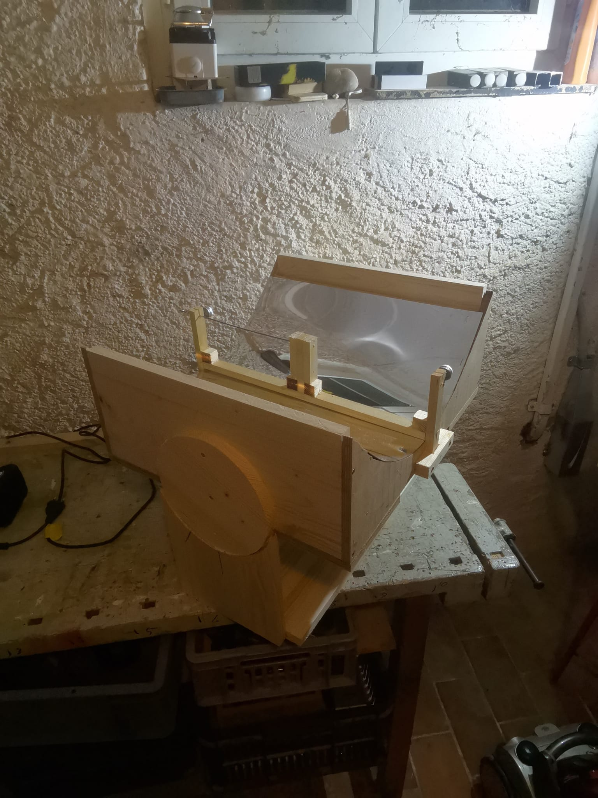

# ParabolicGrill

Python app will calculate the the points of a parabolic mirror.
The results are displayed and presented in OpenOffice Calc.

The design program requires:

### Arc length of mirror

This is the pysical size of the flexable mirror.

The side that will be bent to a parabola.

### X Dimension of resultant Parabola

This dimension must be smaller than the Arc length of mirror.

### Y Dimension of Mirror

This is a dummy parameter for the calculation. Same as the Arc Length.
The value will itterate to the final Y dimension that corresponds to
the arc length and X dimension of the mirror.

## Program Input Screen

## Program Summary Report

## Final Prototype

## PHOTO

